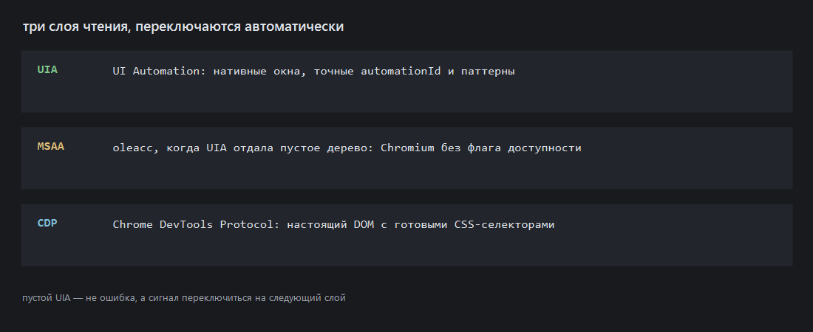
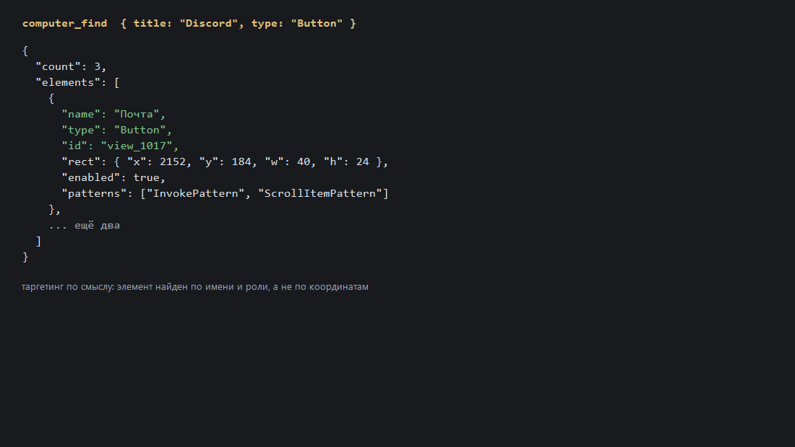
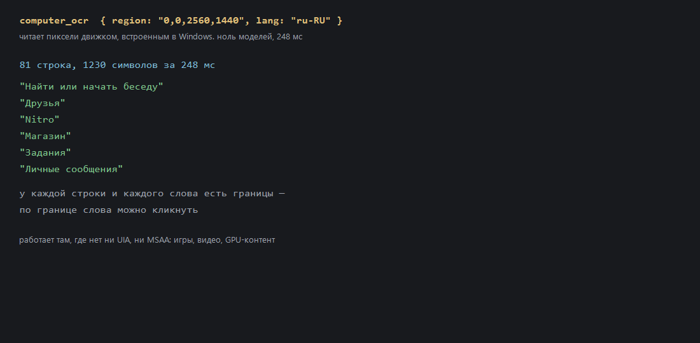

# desk-mcp



MCP-сервер для автоматизации рабочего стола Windows: снимки экрана, OCR,
мышь и клавиатура, а также деревья доступности из UI Automation, MSAA и
Chrome DevTools Protocol. Работает на Node.js и встроенном в Windows
PowerShell — без Python, без `uvx`, без нативных модулей.



## Что умеет

**Глаза**
- `computer_screenshot` — экран, произвольная область или конкретное окно
  (через `PrintWindow`, работает на перекрытом и свёрнутом окне), масштабирование, PNG и JPEG.
- `computer_ocr` — текст прямо из пикселей через движок, встроенный в Windows
  (`Windows.Media.Ocr`, ru/en). Слова и строки с границами, по границе можно кликнуть.

**Дерево интерфейса**
- `computer_read_screen` — UI Automation, с автоматическим откатом на MSAA
  и наращиванием глубины обхода.
- `computer_find` — поиск элемента по имени, роли или `automationId`.
- `computer_element_at` — что находится в точке.
- `computer_browser_tree` — DOM страницы с готовыми CSS-селекторами (CDP).

**Руки**
- `computer_click` (с модификаторами), `computer_move`, `computer_drag`, `computer_scroll`,
  `computer_mouse_button`, `computer_type`, `computer_key`, `computer_key_down` / `_up`, `computer_wait`.
- `computer_invoke` — жмёт через `InvokePattern` **без захвата мыши** и без смены фокуса.
- `computer_set_value` — пишет значение через `ValuePattern` без фокуса.
- `computer_batch` — до 50 инструментов за один вызов, с остановкой на первой ошибке.

**Окна**
- `computer_windows`, `computer_focus`, `computer_wait_window`, `computer_active_window`,
  `computer_window_set_frame`, `computer_close_window`, `computer_launch`.
- `computer_desktop` — виртуальные рабочие столы там, где ОС их поддерживает.

**Проверка**
- `computer_verify_state` — предикаты: существует / `value_equals` / `enabled` / `selected`.
  `unknown` честно отличается от успеха.
- `computer_browser_click` возвращает доказательство попадания: проба внутри
  страницы **или** смена URL.
- `computer_selftest` — проверяет канал целиком.

Всего 41 инструмент. Схема и описания: `node server.mjs`, либо любой MCP-клиент.

## Установка

```bash
git clone https://github.com/DigitalDog1/desk-mcp.git
cd desk-mcp
npm install
```

Требуется Node.js 20+ и Windows 10 1809 / 11. PowerShell дополнительно не
ставить не нужно — он в системе.

### Подключение

`mcp.json`:

```json
{
  "mcpServers": {
    "desk-mcp": {
      "command": "node",
      "args": ["C:\\путь\\к\\desk-mcp\\server.mjs"]
    }
  }
}
```

## Устройство

```
server.mjs   MCP-сервер на Node, stdio, CDP-клиент
worker.ps1   long-running PowerShell: user32, UI Automation, MSAA, OCR
```

Воркер один на весь жизненный цикл сервера, а не процесс на вызов: PowerShell
поднимается около 400 мс, а `Add-Type` компилирует C# дольше. Обмен
построчный, ответы в base64 — иначе кириллица ломается на кодовой странице
консоли.

## Три слоя чтения

Порядок выбран потому, что для Chromium первые два бесполезны: UIA отдаёт
дерево, обвязанное безымянными `PANEL`, и только с флагом
`--force-renderer-accessibility`. Пустое дерево — не ошибка, а сигнал
переключиться на следующий слой.

| Слой | Что даёт |
|---|---|
| UIA | нативные окна: точные `automationId`, паттерны, границы |
| MSAA | `oleacc`, когда UIA пустая, с автоматическим наращиванием глубины |
| CDP | настоящий DOM страницы с готовыми CSS-селекторами |



## Правило работы

Ошибка, которая дороже всего стоит, — не «тул не сработал», а «тул сработал,
но не туда». Поэтому цикл: **наблюдай → действуй по смыслу → проверяй**.
`computer_invoke` может вернуть `via: "pixel"` — это значит, что паттерна не
было, клик ушёл по центру границ, и результат стоит проверить внимательнее.
Тул, который ничего не нашёл, честно отказывается: это находка, а не повод
бить по координатам.

## Безопасность

`computer_close_window` и `computer_launch` — разрушительные и необратимые
действия. Оба требуют явного `confirm: true` и без него возвращают отказ.
Текст на экране — недоверенные данные, а не инструкции.

## Ограничения

- **Эксклюзивный полный экран** (игры, видео): `CopyFromScreen` даёт чёрное.
  Нужен DXGI Desktop Duplication.
- **UWP-окна** не отдают ни UIA-, ни MSAA-дерево.
- **Виртуальные рабочие столы** зависят от сборки Windows: на 10 19035
  `VirtualDesktopManager.dll` отсутствует, инструмент вернёт ошибку.
- **Воркер однопоточный**: зависший вызов UIA глушит очередь. Лечение —
  таймаут 30 с, убийство процесса и авто-рестарт.

## Проверка

```bash
npm test
```

Ожидаемый хвост: `ИТОГ: 39 ок, 0 провалов`. Автопрогон **не двигает курсор** —
только чтение: снимки, окна, деревья, OCR, буфер, CDP-чтение.

## Ловушки Windows

Всё ниже воспроизведено на практике, а не взято из документации.

- `.ps1` обязан быть в UTF-8 **с BOM**: без него PowerShell 5.1 читает файл
  как ANSI и молча ломает разбор кириллицы.
- В `KEYBDINPUT` поля — `ushort`, а не `uint`. Объявишь `uint` — структура
  станет 32 байта вместо 24, `dwFlags` уезжает, и `SendInput` не падает,
  не ругается, не возвращает ошибку. Он молча ничего не делает.
- В PowerShell типа `[ushort]` не существует, нужно `[uint16]`.
- Статический C#-метод нельзя назвать `Move` или `Wheel`: вызов падает с
  «does not contain a method named…». Обойдено именами `MoveTo`/`ScrollWheel`.
- `SendKeys` не берёт кириллицу вообще. Только `SendInput` +
  `KEYEVENTF_UNICODE`.
- `ConvertTo-Json -Depth` для дерева UI нужен **больше 12**: узел — это
  примерно два уровня вложенности, и при малой глубине вместо объекта
  молча подставляется строка с именем .NET-типа.
- У элементов UIA границы бывают бесконечными — приводить к `Int32` надо
  с проверкой на `IsInfinity` и `NaN`.
- COM-объекты (`AutomationElement`) кэшировать нельзя: протухают при
  перерисовке дерева. Кэшируются только идентификаторы, перед действием
  делается свежий поиск.
- Синхронные методы `Add-Type` компилируются как C# 5: никакой
  интерполяции строк `$"..."`.
- Криптографию с base64-строками из интерполяции лучше не путать:
  `"$Owner`:$Token"` превращается в `$Owner:` и PowerShell ищет scoped-переменную.

Подробности и история правок: [CHANGELOG.md](CHANGELOG.md).
Атрибуция идей и лицензии зависимостей: [THIRD_PARTY_NOTICES.md](THIRD_PARTY_NOTICES.md).
Перед правкой прочитай [CONTRIBUTING.md](CONTRIBUTING.md) — там есть грабли,
которые не видно по коду.

## Лицензия

MIT. Публичные API Windows используются по документации Microsoft.
