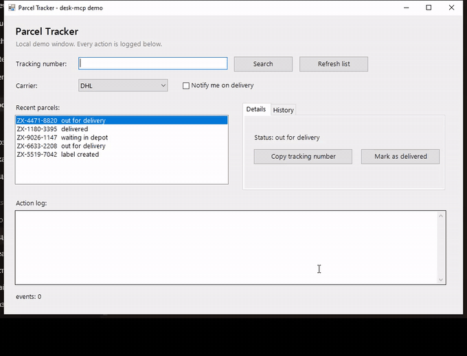
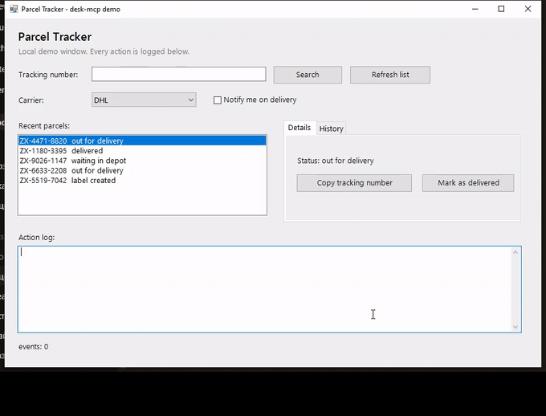

# desk-mcp

<p align="center">
  <a href="README.md">English</a> | <a href="README.ru.md">Русский</a>
</p>

<p align="center">
  <a href="https://glama.ai/mcp/servers/DigitalDog1/desk-mcp"></a>
  
  
  
  
  
</p>

**Управление приложениями Windows из вашего AI-ассистента — с нулевой установкой.**

Сначала прямое управление через accessibility, пиксели только при необходимости, ввод через WinAPI. Клики по имени или ID элемента, чтение таблиц на сотни строк за миллисекунды, ввод без кражи фокуса и экономия до 99% токенов с дифференциальными снимками. Построен на чистом Node.js и встроенном в Windows PowerShell — без .NET SDK, без Python, без компиляторов и без нативных модулей. Работает с Claude Desktop, Cursor, VS Code, Windsurf и любым MCP-клиентом.

---

<h3 align="center">⚡ Живое демо: 10 действий за 2.2 секунды (Hands-Off)</h3>



<p align="center"><sub>24 секунды, без звука. <a href="https://raw.githubusercontent.com/DigitalDog1/desk-mcp/main/docs/demo.mp4">MP4</a> или <a href="https://raw.githubusercontent.com/DigitalDog1/desk-mcp/main/docs/demo.webm">WebM</a>, если нужен полный размер.</sub></p>

На видео выше — обычное WinForms-приложение (`examples/demo-app.ps1`). Пять сложных действий выполняются с нулём пиксельных кликов, нулём галлюцинаций компьютерного зрения, а курсор мыши все время остаётся припаркованным в поле лога, пока `ValuePattern` и `InvokePattern` заполняют поля, вызывают поиск, перезагружают список, помечают посылку доставленной и копируют номер отслеживания. Запустите `node examples/demo.mjs`, чтобы воспроизвести все 10 шагов за 2.2 секунды!

---

## Почему это, а не скриншотный цикл

Большинство агентов компьютерного управления полагаются исключительно на скриншоты: делают снимок, отправляют тысячи токенов зрения в LLM, угадывают координаты пикселей, кликают и повторяют. desk-mcp ставит **прямое управление на первое место**:

| Задача | Подход только со скриншотами | desk-mcp (Прямое управление) |
| :--- | :--- | :--- |
| Клик по кнопке | Оценка координат по картинке (протухает, масштабирование ломает) | Клик по имени или `elementId` через `InvokePattern` |
| Чтение таблиц / списков | Склонный к галлюцинациям OCR; медленная прокрутка экранов | `computer_read_table`: вся таблица за один вызов |
| Проверка чекбокса / состояния | Визуальная оценка состояния по пикселям | Проверка логического состояния через `computer_verify_state` |
| Отслеживание изменений UI | Повторный снимок всего экрана на каждом шаге (высокий расход токенов) | `mode: auto` дифференциальные снимки отдают строго изменения |
| Многошаговые цепочки действий | Несколько сетевых запросов к LLM (высокая задержка) | `computer_batch` выполняет цепочки действий за один сетевой запрос |
| Положение курсора пользователя | Мышь прыгает по экрану, мешая пользователю печатать | Фоновое управление: действия выполняются без перемещения курсора |

- **Точность вместо галлюцинаций**: `computer_find { name: "Search" }` возвращает элемент вместе с его `automationId`, прямоугольником и поддерживаемыми паттернами. Координаты, снятые со скриншота, протухают к моменту клика.
- **Четыре слоя чтения с автоматическим откатом**: UI Automation, затем MSAA через `oleacc`, затем Chrome DevTools Protocol (CDP) для страниц Chromium, затем Windows OCR (`Windows.Media.Ocr`). Если UIA возвращает пустое дерево, desk-mcp автоматически переключается на следующий слой и сообщает его `backend`.
- **Устойчивость к зависаниям через Circuit Breaker**: UI Automation общается по COM и никогда не отпускает зависшее окно (Steam, 1C, зависший WPF). Каждый вызов здесь выполняется на STA-потоке с отменяемым таймаутом, а сбойное окно активирует 90-секундный breaker, пока все остальные окна остаются отзывчивыми.
- **Ноль внешних бинарников**: Чистый Node.js + встроенный в Windows PowerShell 5.1. Мгновенный запуск `npx -y desk-mcp` — без Visual C++ Build Tools, без .NET 10 SDK, без Python и необходимости компиляции.

## Установка

```bash
npm install -g desk-mcp
```

или из клона:

```bash
git clone https://github.com/DigitalDog1/desk-mcp.git
cd desk-mcp
npm install
```

Требуется Node.js 20+ и Windows 10 1809 или Windows 11.

### Подключение

Добавьте в конфигурацию вашего MCP-клиента (**Claude Desktop** в `%APPDATA%\Claude\claude_desktop_config.json`, **Cursor** в `.cursor/mcp.json`, или **Windsurf** / **VS Code**):

```json
{
  "mcpServers": {
    "desk-mcp": {
      "command": "npx",
      "args": ["-y", "desk-mcp"]
    }
  }
}
```

Для клона замените `npx` на `node`, а в `args` укажите путь к `server.mjs`. Перезапустите клиент, и инструменты сразу появятся.

## Первый результат за 60 секунд

```bash
# 1. окно для работы (английские подписи, каждое действие пишется в само окно)
powershell -NoProfile -ExecutionPolicy Bypass -STA -File examples\demo-app.ps1

# 2. сторона агента: найти по смыслу, записать через ValuePattern,
#    нажать через InvokePattern и проверить результат
node examples/demo.mjs
```

```
--- 1. Найти окно "Parcel Tracker" и кнопку Search по automationId
{
  "count": 1,
  "elements": [
    {
      "name": "Search",
      "type": "Button",
      "id": "btnSearch",
      "class": "WindowsForms10.BUTTON.app.0.ab05f7_r37_ad1",
      "rect": { "x": 530, "y": 173, "w": 120, "h": 32 },
      "enabled": true,
      "offscreen": false,
      "patterns": [ "InvokePattern" ]
    }
  ]
}

--- 3. Записать номер через ValuePattern, без фокуса и без мыши
{
  "ok": true,
  "via": "ValuePattern",
  "value": "ZX-9026-1147",
  "element": { "name": "Tracking number:", "type": "Edit", "id": "searchBox", ... }
}

--- 4. Нажать Search через InvokePattern
{ "ok": true, "via": "InvokePattern", "element": { "id": "btnSearch", ... } }

--- 5. Проверить значение поля, а не просто факт нажатия
{ "ok": true, "checks": [ { "state": "satisfied", "detail": "found 1" } ] }

--- 6. Нажать Copy tracking number и прочитать буфер обмена
буфер обмена: "ZX-4471-8820" (12 символов)
```

В локализованной Windows кнопки заголовка возвращаются с переведёнными именами (`Закрыть`, `Развернуть`, `Свернуть` в русской версии). Предпочитайте `automationId` тексту заголовка, иначе агент сломается на локали пользователя.

## То же окно, но через курсор



<p align="center"><sub>То же окно, тот же результат, другой механизм. <a href="https://raw.githubusercontent.com/DigitalDog1/desk-mcp/main/docs/demo-cursor.mp4">MP4</a> или <a href="https://raw.githubusercontent.com/DigitalDog1/desk-mcp/main/docs/demo-cursor.webm">WebM</a> для полного размера.</sub></p>

Обычный `computer_click` по координатам перемещает курсор, так что приложение не отличает агента от человека. При этом кнопка WinForms игнорирует синтетический клик, если он поступает в то же мгновение, что и перемещение курсора: `nudge` не спасает, спасает `hoverFirst: true` (250 мс над элементом перед нажатием). Замерено на тех же координатах и том же окне: без hover счётчик остался на 0, с ним событие сработало. Используйте `hoverFirst: true` по умолчанию для пиксельных кликов в незнакомых приложениях.

## Сколько это стоит, в числах

`npm run bench:full` обходит каждое видимое окно, замеряет чтение несколько раз, берёт медиану и выводит числа токенов и задержки. Текстовые токены считаются как `символы / 4`, токены картинок по формуле Anthropic `ширина * высота / 750`. Числа ниже получены на Windows 10, i5-12400F, Node 24 на живых окнах:

| Окно | Размер | `find` | Всё дерево | `compact` | Фильтрованное | Повтор (`auto`) | Картинка | OCR |
| --- | ---: | ---: | ---: | ---: | ---: | ---: | ---: | ---: | ---: |
| Microsoft Edge (Браузер) | 2576x1416 | 110 | 8552 | 7388 | 197 | 38 | 4864 | 16191 |
| Проводник Windows (Файлы) | 1270x859 | 98 | 57844 | 47874 | 2764 | 38 | 1455 | 6808 |
| LibreOffice (Офисный пакет) | 2576x1416 | 99 | 29096 | 24486 | 6797 | 38 | 4864 | 17927 |
| Каталог шрифтов (Таблица) | 896x599 | 97 | 54514 | 43708 | 4142 | 38 | 716 | 3424 |
| Parcel Tracker (Демо-окно) | 940x640 | 83 | 12837 | 10536 | 3135 | 38 | 803 | 5074 |
| MS Paint (Холст и инструменты) | 1843x1005 | 83 | 8247 | 6843 | 1898 | 38 | 2470 | 6285 |

Фильтрованное дерево это `maxDepth: 4, interactiveOnly: true, compact: true`. Повтор — то же чтение через `mode: auto` с токеном из предыдущего ответа. Токены картинок рассчитаны по реальным пикселям возвращённого изображения, а не по прямоугольнику окна.

Ключевые выводы из измерений на живых окнах:

- **Фильтрация меняет всё**: Сырое дерево интерфейса без обрезки включает глубокие внутренние контейнеры (от 8 000 до 58 000 токенов). Разумные фильтры (`maxDepth: 4, interactiveOnly: true, compact: true`) снижают объём до 197–2 700 токенов — до 25 раз дешевле скриншота, сохраняя прямую адресуемость каждого интерактивного элемента.
- **Дифференциальные снимки (`mode: auto`) экономят 99.7% токенов**: Первый осмотр задаёт базу; каждый последующий вызов с токеном возвращает строго дельту (всего 38 токенов при повторах против 8 552 – 57 844 при первом чтении). Это самая дешёвая строка таблицы и причина возвращать токен назад.
- **Адресуемость вместо догадок**: Скриншот не даёт адресуемых элементов; каждый клик требует визуальной оценки координат, которая легко ломается при масштабировании или сдвиге окна. UI Automation отдаёт элементы примерно по 100 токенов с точными ID и паттернами.
- **Задачи с плотными данными (каталог шрифтов: 246 элементов)**: Когда агенту нужно найти элемент в большом списке или таблице, визуальная прокрутка требует 14 страниц скриншотов, 29 вызовов и 73 секунды. В desk-mcp `computer_read_table` читает все 246 строк за 158 мс, позволяя решить задачу за 3 вызова и 7.9 секунды (в 9.4 раза быстрее, в 10 раз меньше сетевых запросов).
- `compact` экономит от 14% до 18% на больших деревьях.
- OCR — самый слабый способ читать окно целиком и самый сильный, когда координаты известны: отдельная строка обходится в ~300 токенов против тысяч токенов за полное окно.
- Обход дерева медленнее снимка экрана: ~65 мс против 16 мс на нативных окнах. UIA ходит по COM в другой процесс.

### Где это проигрывает

- **Координаты уже известны.** Читать всё окно ради одного поля в 6–11 раз дороже, чем OCR этого поля.
- **Без фильтра, а вопрос визуальный.** Картинка в 3–16 раз дешевле, и только она отвечает «какого цвета кнопка» или «не поехала ли вёрстка». В структуре этих ответов нет ни за какую цену.
- **Протухший токен.** Каждый ответ `mode: auto` возвращает новый токен, и следующий вызов обязан передать его. Передадите старый — сервер вернёт всё дерево целиком (в 67–426 раз больше токенов). Это сделано намеренно: дифференциал относительно базы, которой у клиента больше нет, был бы выдуманным.
- **Окно непрерывно перерисовывается.** Изменения накапливаются, дельта перерастает полный вид, и сервер отдаёт дерево целиком.
- **Нет дерева accessibility** (игры, UWP, защищённый контент). Ответ приходит как `kind: fallback` с текстом OCR и без дельты, как в Wallpaper UI выше.
- **Таблица без строки заголовков.** У `TablePatternInformation` в .NET нет признака «эта строка заголовок», поэтому `computer_read_table` считает первую строку заголовком по соглашению. Параметр `headers: false` читает каждую строку как данные.

### Чего этот замер не учитывает

- Числа сняты на этой машине и на этих открытых окнах. На другой машине таблица будет другой, возможно на порядок.
- Замер показывает стоимость чтения, а не то, выбрал ли агент правильный инструмент.
- Нагрузка не создавалась специально: нет фоновых тяжёлых приложений, окна не меняли размер, не менялся DPI мониторов.
- Токены текста считаются как `символы / 4`. Кириллица на практике стоит дороже, но обе стороны проигрывают одинаково.
- Токены картинок рассчитаны по опубликованным формулам. Реальный счёт зависит от модели и нарезки тайлов клиентом.

`npm run bench` — старый замер только токенов, `npm run bench:full` — полный бенчмарк окон, а `npm run bench:fonts` замеряет выполнение реальной задачи на таблице из 246 строк. Разрешение окон идёт через `user32` напрямую по дескриптору, поэтому зависший сосед никогда не подвесит сервер. Полный прогон демо-приложения от начала до конца: `node examples/demo.mjs` завершается за 2.2 с.

## 46 инструментов

**Глаза**

- `computer_screenshot`: весь экран, область или отдельное окно через `PrintWindow` или `hwnd`, работающее даже для перекрытых и свёрнутых окон. PNG или JPEG, любой масштаб.
- `computer_ocr`: текст прямо из пикселей через встроенный OCR Windows (`Windows.Media.Ocr`, en и ru). Слова возвращаются с координатами прямоугольников для клика. Без подсказок OCR шумит: на демо-окне номер `ZX-4471-8820` превратился в `zx-=v-882C`.
- `computer_screeninfo`: границы виртуального экрана и каждый подключённый монитор.
- `computer_permissions`: проверяет работу UI Automation, буфера обмена и перечисления окон на этой машине, выявляя проблемы сразу при настройке, а не в середине сессии агента.

**Дерево интерфейса**

- `computer_read_screen`: UI Automation с автоматическим откатом на MSAA, динамическим ростом глубины и откатом на OCR (сообщает `backend` и `degraded`). `mode: auto` с параметром `since` возвращает только изменённые узлы; `compact`, `maxChars`, `maxDepth`, `maxElements` и `interactiveOnly` радикально сокращают контекст. Поддерживает `truncatedReason`.
- `computer_read_table`: заголовки и строки таблицы, списка или режима Details через `GridPattern`, один вызов вместо полного обхода дерева. Первая строка считается заголовком по соглашению (`headersByConvention`); `headers: false` отключает это поведение.
- `computer_find`: поиск элементов по имени, роли, `automationId`, регулярному выражению (`nameRegex`) или точному совпадению (`requireUnique`). Возвращает `searchIncomplete` при исчерпании лимита.
- `computer_element_at`: инспектирует цепочку элементов непосредственно под точкой экрана.
- `computer_browser_start`, `computer_browser_list`, `computer_browser_tree`, `computer_browser_descendants`, `computer_browser_eval`, `computer_browser_click`: реальный DOM страниц через Chrome DevTools Protocol (computer_browser_*), с CSS-селекторами и кликами, сообщающими, кто именно получил событие.

**Руки**

- `computer_click` (модификаторы, `nudge`, `scale`, `hoverFirst`), `computer_move`, `computer_cursor`, `computer_mouse_move`, `computer_drag`, `computer_scroll`, `computer_mouse_button`, `computer_type` (поддерживает `inputMode: paste` и `delayMs`), `computer_key`, `computer_key_down` / `computer_key_up`, `computer_wait`.
- `computer_polyline`: один непрерывный штрих по списку точек. N отдельных перетаскиваний поднимают перо на каждой вершине и приходят ломаными отрезками.
- `computer_invoke`: вызывает `InvokePattern` без перемещения мыши и без перевода фокуса на окно. Адресуется по имени или напрямую по `elementId` из `computer_find`.
- `computer_set_value`: запись через `ValuePattern` без фокуса, принимает `elementId` и `inputMode: value | type | paste`.
- `computer_select`: выбор значения в выпадающем списке, комбобоксе или вкладке через `SelectionItem` и `ExpandCollapse` с автоматическим раскрытием и закрытием (принимает `elementId`). Если паттерн отработал, но ничего не выбрал, возвращается статус `notSelected`.
- `computer_batch`: до 50 инструментов за один вызов, выполняемых последовательно с подстановкой параметров (`"${steps.0.element.name}"`), превращая циклы «прочитать-решить-сделать» в один сетевой запрос.

**Окна и рабочий стол**

- `computer_windows`: видимые окна верхнего уровня с `title`, `hwnd`, `process`, `class` и границами. Передавайте `hwnd` в последующих вызовах, чтобы окна оставались доступны при динамической смене заголовка.
- `computer_focus`, `computer_wait_window`, `computer_active_window`, `computer_window_set_frame`, `computer_close_window`, `computer_launch`, `computer_desktop` (виртуальные рабочие столы), `computer_bench`, `computer_clipboard_get` и `computer_clipboard_set`.

**Проверка**

- `computer_verify_state`: проверка условий `exists`, `value_equals`, `enabled`, `selected`. Статус `unknown` отдаётся как `unknown` и никогда как успех.
- `computer_wait_element`: ожидание появления, исчезновения или состояния элемента (`enabled`, `disabled`, `visible`, `offscreen`, `on`, `off`, `indeterminate`) вместо слепых пауз. По таймауту возвращает `satisfied: false` с причиной `reason: timeout`.
- `computer_invoke`, `computer_set_value` и `computer_select_text` отказывают при `enabled: false`, предотвращая ложный успех на заблокированных элементах управления.
- Каждый сбой сопровождается типизированным кодом `code` (`ElementNotFound`, `ElementDisabled`, `OptionNotFound`, `PatternUnavailable`, `NotSelected`, `WindowNotFound`, `NeedsConfirm`, `BlockedByList`, `InvalidArgument`, `NotSupported`, `WorkerRestarted`, `Timeout`, `UIABlocked`, `CaptureFailed`, `InputBlocked`, `AmbiguousMatch`).
- `computer_selftest` проверяет весь коммуникационный канал сквозным тестом.

## Как это устроено

```
server.mjs      MCP-сервер на Node по stdio, CDP-клиент, circuit breaker
worker.ps1      один долгоживущий PowerShell: user32, UI Automation, MSAA, OCR
uia-native.cs   C# 5: STA-пул с очередью, отменяемый таймаут, перерождение потоков
```

Один процесс воркера живёт на протяжении всей работы сервера. Общение построчно с base64-ответами гарантирует сохранность кодировки независимо от кодовой страницы консоли Windows.

| Слой | Что отдаёт | Когда используется |
| --- | --- | --- |
| UIA | точный `automationId`, паттерны, границы | нативные и управляемые приложения Windows |
| MSAA | `oleacc`, глубина растёт сама | когда UIA вернул пустое дерево |
| CDP | реальный DOM страницы с CSS-селекторами | окна Chromium, точные селекторы |
| OCR | слова с прямоугольниками, без идентичности | игры, видео, аппаратно отрисованный контент |

Иерархия откатов принципиальна. Для Chromium UIA возвращает безымянные панели без ключа `--force-renderer-accessibility`; встроенный слой CDP даёт прямой доступ к DOM и проверку.

## Когда окно зависает

UI Automation обращается в другие процессы по COM. Если целевое приложение зависло или удерживает модальное окно, вызов COM RPC никогда не возвращает управление. desk-mcp решает это полностью:

- `uia-native.cs` выполняет чтение на выделенном STA-потоке с жёстким отменяемым таймаутом. Зависшие потоки изолируются и заменяются свежими, пока старый поток завершается в фоне.
- Это примерно в 7 раз быстрее чистого PowerShell: 147 мс против 1014 мс на одном и том же окне qBittorrent.
- Автоматический Circuit Breaker: сбойные вызовы активируют прерыватель для данного окна на 90 с, возвращая мгновенную ошибку вместо повторного зависания. Все остальные окна работают штатно.
- Общий дедлайн 8 с надёжно защищает от зависших внешних воркеров.

Переменные `DESK_UI_TIMEOUT_MS`, `DESK_UI_COOLDOWN_MS` и `DESK_UIA_BUDGET_MS` настраивают эти бюджеты.

При зависании приложения desk-mcp немедленно сообщает о причине:

```
Error: UI Automation hung on 'invoke|modorganizer': no response in 8 s, worker restarted.
Window does not answer UIA - calls to it are blocked for 90 s.
Next: computer_screenshot + computer_ocr, or another window.
```

## Игры

Шутеры и 3D-игры читают ввод мыши через raw input и игнорируют абсолютные координаты. Используйте относительное перемещение малыми шагами:

```json
{ "tool": "computer_mouse_move", "args": { "dx": 220, "dy": -40, "steps": 20, "stepMs": 8 } }
```

Графические редакторы вроде MS Paint игнорируют мгновенные клики без движения. Сдвиньте курсор на один пиксель:

```json
{ "tool": "computer_click", "args": { "x": 800, "y": 400, "nudge": 1 } }
```

Кнопки WinForms требуют, чтобы курсор оказался над ними *до* нажатия: используйте `hoverFirst: true` (пауза 250 мс перед кликом):

```json
{ "tool": "computer_click", "args": { "x": 590, "y": 189, "hoverFirst": true } }
```

Автоматическое масштабирование координат при работе со сжатыми скриншотами:

```json
{ "tool": "computer_screenshot", "args": { "region": "0,0,2560,1440", "scale": 0.5 } }
{ "tool": "computer_click", "args": { "x": 640, "y": 360, "scale": 0.5 } }
```

## Безопасность

Инструменты `computer_close_window` и `computer_launch` деструктивны и требуют явного подтверждения `confirm: true`. Текст, прочитанный с экрана, обрабатывается строго как данные и никогда не исполняется как инструкции.

Автоматический тестовый набор строго пассивен: он никогда не перемещает и не перехватывает курсор пользователя.

## Запуск агента без присмотра

Четыре переключателя через переменные окружения обеспечивают автономную и безопасную работу агента:

```bash
# Предпросмотр действий без выполнения мутаций
DESK_DRY_RUN=1 npx -y desk-mcp

# Аудит каждого вызова инструмента, параметров, времени и результата в JSONL
DESK_AUDIT=1 npx -y desk-mcp
DESK_AUDIT_PATH=C:\logs\desk-mcp.jsonl npx -y desk-mcp

# Ограничение действий окнами с определёнными заголовками (проверка до вызова)
DESK_ALLOW_TITLES="Блокнот|Notepad" npx -y desk-mcp

# Полное отключение выбранных инструментов (поддерживается маска *)
DESK_DISABLE_TOOLS=computer_click,computer_type npx -y desk-mcp
```

Отключённые инструменты разрегистрируются из сервера; агенты не видят их в списке и не могут вызвать, а `computer_batch` отвергает их по имени.

Логи аудита сохраняют одну структурированную запись на каждый вызов:

```
2026-10-06 10:07:02 tool=invoke title="Parcel Tracker" ms=33 outcome=ok via= dryRun=True
2026-10-06 10:07:02 tool=invoke title="Roblox" ms=6 outcome=error via= dryRun=True
```

## Ограничения

- **Только Windows.** Повсеместно используются Win32, UI Automation и Windows runtime API.
- **Игры в эксклюзивном полноэкранном режиме**: `CopyFromScreen` возвращает чёрный экран. Оконные DirectX-игры работают корректно через `PrintWindow`.
- **Окна UWP**: отдают ограниченные деревья UIA/MSAA; desk-mcp автоматически переключается на OCR.
- **Chromium**: используйте встроенные инструменты CDP для полного контроля DOM без необходимости запуска с флагами.
- **Виртуальные рабочие столы**: зависит от сборки Windows; старые сборки без `VirtualDesktopManager.dll` возвращают ошибку.
- **Roblox**: клики могут не срабатывать в защищённых окнах клиента.
- Поиск элементов для `invoke` и `set_value` пока не имеет отменяемого таймаута (см. выше).

## Тесты

```bash
npm test
npm run check:docs      # README.md и README.ru.md описывают одно и то же
```

Ожидаемый итог: `ИТОГ: 85 ок, 0 провалов, N пропущено`. Тестовый раннер выводит на русском:
`ок` — пройдено, `провалов` — ошибки, `пропущено` — пропущенные проверки. Пропущенная проверка
означает, что какое-то окно в системе не ответило на UI Automation (Steam, 1C, старый WPF держат
вызов COM открытым), и сработал предохранитель. Это свойство стороннего приложения, а не дефект,
поэтому прогон не считается провальным. Число провалов выше нуля — реальная ошибка.

Предохранитель UIA проверяется запуском второго сервера с бюджетом 1 мс: проверяется, что первый вызов зависает, второй блокируется, и оба возвращают диагностику.

## Подводные камни Windows

Всё нижеперечисленное воспроизведено на практике, а не взято из документации:

- Воркер вызывает `SetProcessDpiAwarenessContext(PER_MONITOR_AWARE_V2)` перед любым вызовом UI. Без этого UIA и OCR отдают логические координаты, а `SendInput` работает в физических пикселях, из-за чего клики промахиваются на масштабированных экранах.
- Файл `.ps1` обязан сохраняться в кодировке UTF-8 **с BOM**, иначе PowerShell 5.1 прочитает его как ANSI и молча сломает кириллицу.
- В структуре `KEYBDINPUT` поля имеют тип `ushort`, а не `uint`. Объявление `uint` раздувает структуру до 32 байт вместо 24, смещая `dwFlags` и приводя к сбоям `SendInput`.
- В PowerShell нет типа `[ushort]`; необходимо использовать `[uint16]`.
- Статические методы C# не могут называться `Move` или `Wheel` (конфликт имён PowerShell); переименованы в `MoveTo` / `ScrollWheel`.
- `SendKeys` не печатает кириллицу надёжно; desk-mcp использует `SendInput` с флагом `KEYEVENTF_UNICODE`.
- Параметр `ConvertTo-Json -Depth` для дерева UI обязан быть больше 12 во избежание поверхностной строковой сериализации типов .NET.
- UI Automation может возвращать бесконечные координаты; desk-mcp проверяет `IsInfinity` и `NaN` перед приведением к `Int32`.
- COM-объекты `AutomationElement` нельзя кэшировать между действиями, так как нативные деревья меняются; кэшируются идентификаторы с повторным получением свежих дескрипторов.
- `Add-Type` компилирует код под C# 5 (без интерполяции `$"..."`).
- Интерполяция переменных перед двоеточием (`"$Owner:$Token"`) требует фигурных скобок (`"${Owner}:$Token"`).

## Куда смотреть дальше

Продолжая работу над репозиторием, будь вы человек или агент, начните с
`AGENTS.md`. В нём описано актуальное состояние, что и как проверено, подводные камни
и следующие приоритетные цели.

- [CHANGELOG.md](CHANGELOG.md): каждое изменение с замерами и причинами, включая опровергнутые гипотезы.
- [CONTRIBUTING.md](CONTRIBUTING.md): грабли, которые не видны только по коду.
- [THIRD_PARTY_NOTICES.md](THIRD_PARTY_NOTICES.md): авторство и лицензии зависимостей.

## Лицензия

Apache License 2.0. Публичные API Windows используются в соответствии с документацией Microsoft.